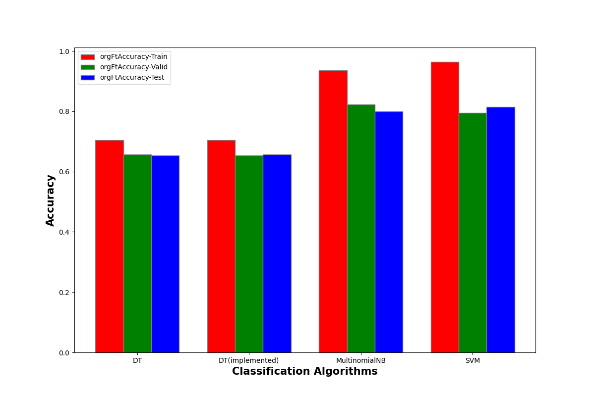
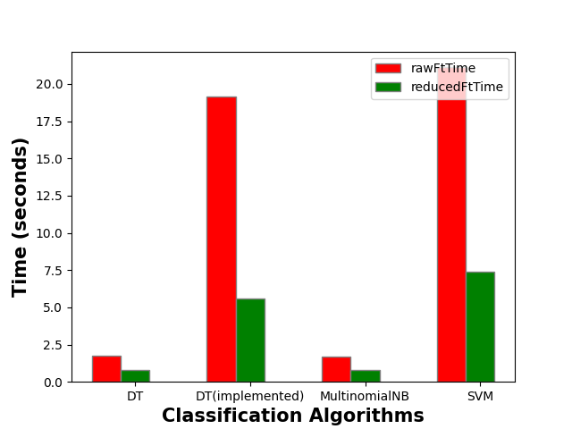

# Classification Algorithms analysis

Implementing Decision Tree and compared with other classification algorithms in sklearn library.

## Structure
Main programming files are:
```bash
main.py preprocessing.py data_splitting.py classification.py 
decision_tree.py my_decision_tree.py naive_bayes.py svm.py
```
Input files are
```bash
amazon_cells_labelled.txt imdb_labelled.txt yelp_labelled.txt
```
Extra files:
- rawFtAccuracy.png and reducedFtAccuracy.png saved output bar charts
- HW 3 Report.pdf
output:
 - console ouput: each algorithm's time and accuracy perfomance
 -  bar charts to visualize the output data

## Usage

1. Run the main.py file
2. give the input **amazon_cells_labelled.txt imdb_labelled.txt yelp_labelled.txt** when see the prompt

## Result bar charts
 Using raw feature matrix:
 
 
 
 After Applying feature selection algorithm (result_chart/top K frequent words)
 
 
 Compare the performance on time:
 
 
 
## License and Authority
Leon Cai (https://github.com/LeonCai1)
